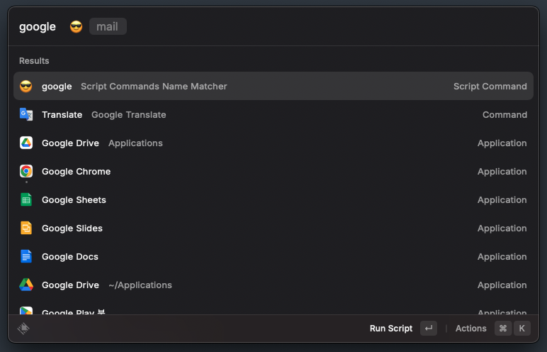

This repository contains a Raycast script command designed to match user input with a list of predefined names and open the corresponding URL in a browser.

## Usage

1. Edit the script to add or modify the name-URL pairs according to your preferences.
2. For instructions on adding this custom script to Raycast, please refer to the [Raycast script-commands documentation](https://github.com/raycast/script-commands).
